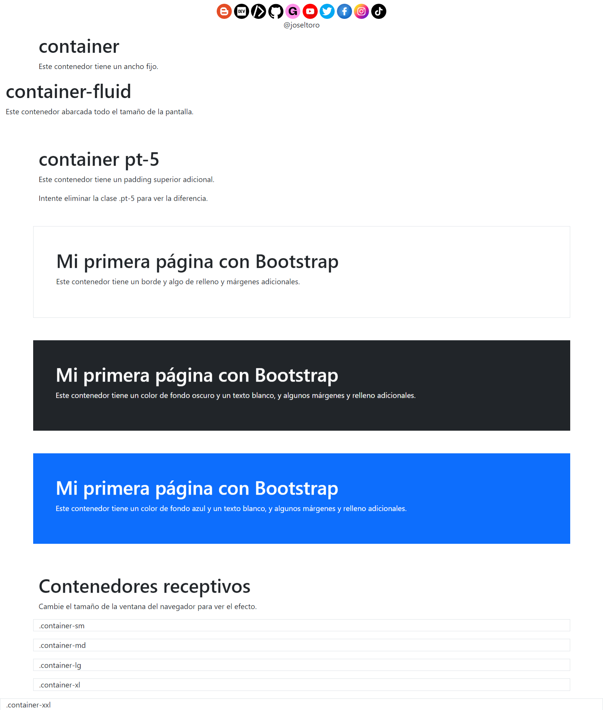

# Bootstrap 5 | Containers

📒 Bootstrap 5 Contenedores

    📝 Bootstrap requiere un elemento contenedor para envolver los contenidos del sitio.
    📝 Los contenedores se utilizan para rellenar el contenido dentro de ellos y hay dos clases de contenedores disponibles:
        🔸 La clase .container proporciona un contenedor de ancho fijo receptivo.
        🔸 La clase .container-fluid proporciona un contenedor de ancho completo, que abarca todo el ancho de la ventana gráfica.

📒 Contenedor Fijo

    📝 Utilice la clase .container para crear un contenedor receptivo de ancho fijo.
    📝 Tenga en cuenta que su ancho (ancho máximo) cambiará en diferentes tamaños de pantalla:

                            max-width

        Extra small         100%
        <576px	
        
        Small               540px
        ≥576px	
        
        Medium              720px
        ≥768px	
        
        Large               960px
        ≥992px	
        
        Extra Large         1140px
        ≥1200px	
        
        XXL                 1320px
        ≥1400px

        
        Nota:

        El punto de interrupción XXL (≥1400px) es nuevo en Bootstrap 5, mientras que el punto de interrupción más grande en Bootstrap 4 es Extra grande (≥1200px).

        

            <h1>My First Bootstrap Page</h1>
            
This is some text.

        

📒 Contenedor de fluidos

    📝 Use la clase .container-fluid para crear un contenedor de ancho completo, que siempre abarcará todo el ancho de la pantalla (el ancho siempre es 100%):
   						
        

            <h1>My First Bootstrap Page</h1>
            
This is some text.

        

📒 Relleno de contenedores

    📝 De forma predeterminada, los contenedores tienen relleno izquierdo y derecho, sin relleno superior o inferior. Por lo tanto, a menudo usamos utilidades de espaciado, como relleno y márgenes adicionales para que se vean aún mejor. Por ejemplo, .pt-5 significa "agregar un relleno superior grande":

        

📒 Borde y color del contenedor

    📝 Otras utilidades, como bordes y colores, también se usan a menudo junto con los contenedores:
    
        

        

        

📒 Contenedores receptivos

    📝 También puede usar las clases .container-sm|md|lg|xl para determinar cuándo debe responder el contenedor.
    📝 El ancho máximo del contenedor cambiará en diferentes tamaños de pantalla/ventanas:

        
.container-sm

        
.container-md

        
.container-lg

        
.container-xl

        
.container-xxl

Redes sociales:

- https://instagram.com/dev.joseltoro
- https://facebook.com/devjoseltoro
- https://tiktok.com/@dev.joseltoro
- https://dev.to/joseltoro
- https://code.dcoder.tech/profile/joseltoro
- https://joseltoro.blogspot.com/
- https://joseltoro.gumroad.com/